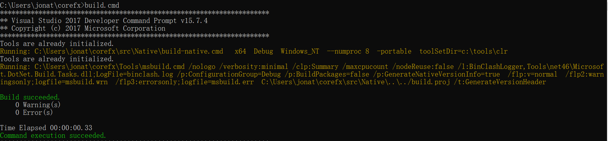
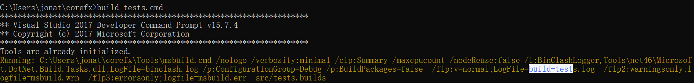
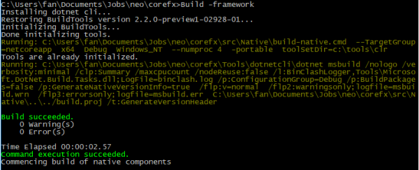
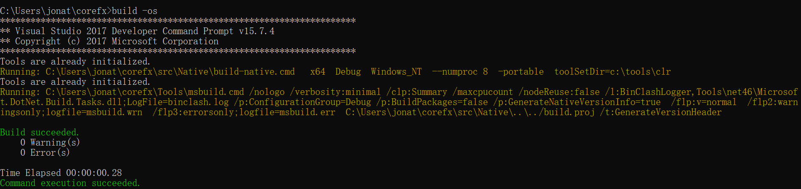
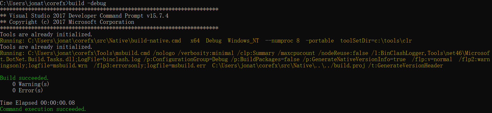
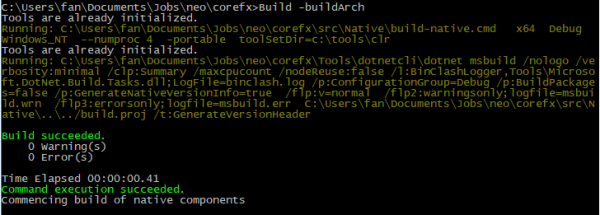

```
Git clone https://github.com/dotnet/corefx.git

Cd ../corefx
```

- `build.cmd`



基本工具初始化

创建References, Libraries 和 packages 的默认设置文件

- `build-tests.cmd`


测试编译运行默认的设置

- `Build -framework `


此build的Framework版本。默认是`netcoreapp`但也可以是`netCoreApp`, `netFX` 或者 `UAP` (msbuild property `TargetGroup`).

- `Build -os `

  

此build的运行系统。默认是你的系统，可以是 `Windows_NT`, `Unix`, `Linux`, 或`OSX`. (msbuild property `OSGroup`)

- `Build -debug|-release`

  

选择编译器的类别。. (msbuildproperty `ConfigurationGroup`)

- Build -buildArch


确定构建的体系结构。 它默认为x64，但可能的值包括x64，x86，arm或arm64。 (msbuildproperty `ArchGroup`)

You can find more detailed information here:
https://github.com/dotnet/corefx/blob/master/Documentation/project-docs/developer-guide.md
=======
# corefx-guide
